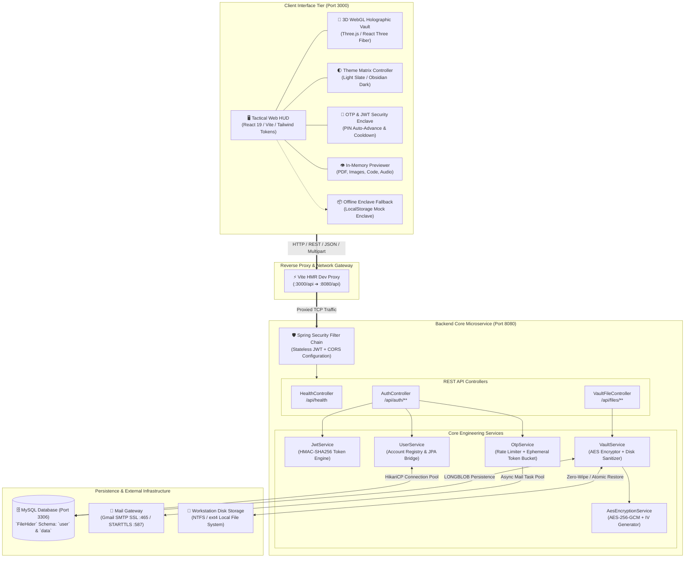
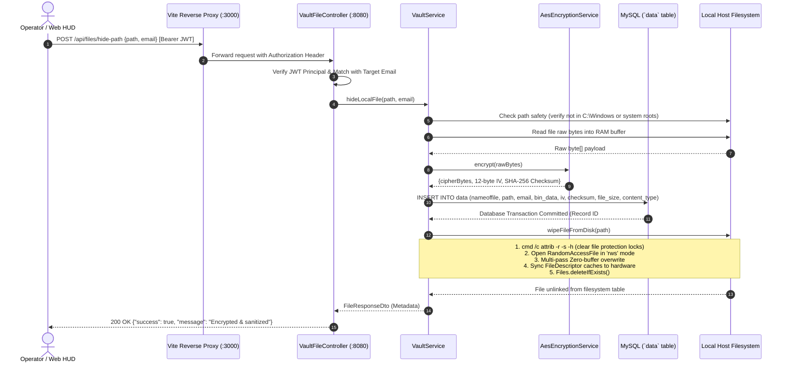
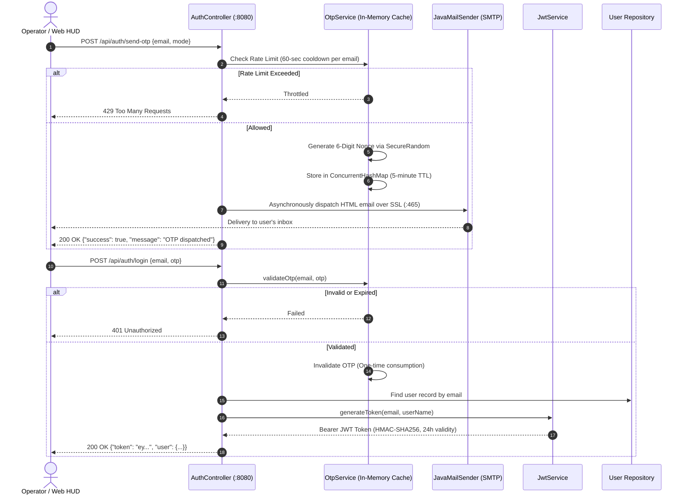
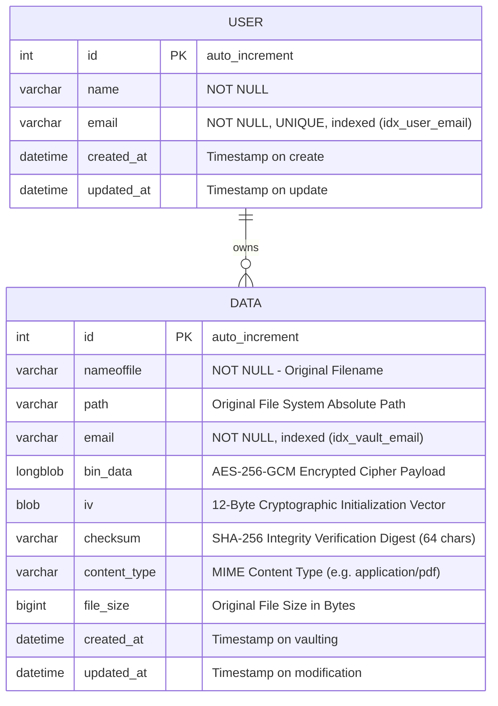

<div align="center">

# 🛡️ CYPHERVAULT

### *Enterprise Military-Grade Zero-Knowledge File Isolation, Encapsulation & Anti-Forensic Storage Engine*

[](https://spring.io/projects/spring-boot)
[](https://www.oracle.com/java/)
[](https://react.dev/)
[](https://vitejs.dev/)
[](https://threejs.org/)
[](https://www.mysql.com/)
[](#-theme-engine-matrix)
[](LICENSE)

<br/>

<p align="center">
  <b>CypherVault</b> is a production-grade cryptographic file encapsulation and zero-trace security platform designed to isolate, protect, and anti-forensically sequester sensitive host data. By transforming physical files into <b>AES-256-GCM encrypted binary payloads</b>, persisting them inside an isolated relational database enclave (<code>LONGBLOB</code>), and <b>forensically scrubbing host disk sectors with low-level zero-overwrites</b>, CypherVault guarantees a zero residual host footprint until OTP/JWT-authenticated restoration.
</p>

[System Architecture](#-system-architecture--blueprint) • [Backend Instructions](#-backend-engineering--instructions) • [Frontend Instructions](#-frontend-engineering--instructions) • [Quick Start (3 Mins)](#-full-stack-quickstart-guide) • [REST API Reference](#-rest-api-specification) • [Database Schema](#-database-architecture--schema)

---

</div>

## 📑 Table of Contents

- [🌟 Executive Summary](#-executive-summary)
- [⚖️ Architecture Matrix (CypherVault vs. Traditional Hiding)](#️-architecture-matrix)
- [🏗️ System Architecture & Blueprint](#️-system-architecture--blueprint)
  - [High-Level Tier Architecture](#high-level-tier-architecture)
  - [Concealment & Anti-Forensic Disk Wipe Pipeline](#concealment--anti-forensic-disk-wipe-pipeline)
  - [Reversible Decryption & Restoration Pipeline](#reversible-decryption--restoration-pipeline)
  - [Zero-Knowledge MFA OTP & JWT Authentication Flow](#zero-knowledge-mfa-otp--jwt-authentication-flow)
- [🗄️ Database Architecture & Schema](#️-database-architecture--schema)
  - [Entity Relationship Diagram (ERD)](#entity-relationship-diagram-erd)
  - [Table Specifications (`user` & `data`)](#table-specifications)
- [⚙️ Backend Engineering & Instructions](#️-backend-engineering--instructions)
  - [Backend Tech Stack & Design Patterns](#backend-tech-stack--design-patterns)
  - [Backend Prerequisites](#backend-prerequisites)
  - [Backend Configuration (`application.properties`)](#backend-configuration)
  - [Step-by-Step Backend Setup & Execution](#step-by-step-backend-setup--execution)
  - [Actuator & Swagger OpenAPI Documentation](#actuator--swagger-openapi-documentation)
- [🖥️ Frontend Engineering & Instructions](#️-frontend-engineering--instructions)
  - [Frontend Tech Stack & Design System](#frontend-tech-stack--design-system)
  - [Component Tree & Architecture](#component-tree--architecture)
  - [Offline Enclave Demo Mode](#offline-enclave-demo-mode)
  - [Frontend Prerequisites](#frontend-prerequisites)
  - [Step-by-Step Frontend Setup & Execution](#step-by-step-frontend-setup--execution)
  - [Vite Reverse Proxy Routing](#vite-reverse-proxy-routing)
- [🌓 Theme Engine Matrix](#-theme-engine-matrix)
- [⚡ Full-Stack Quickstart Guide](#-full-stack-quickstart-guide)
- [🔌 REST API Specification](#-rest-api-specification)
  - [1. Core Health Monitor](#1-core-health-monitor)
  - [2. Authentication Service](#2-authentication-service)
  - [3. Vault File Service](#3-vault-file-service)
- [🔒 Security & Threat Model](#-security--threat-model)
- [🛠️ Troubleshooting & Diagnostics](#️-troubleshooting--diagnostics)
- [🗺️ Future Engineering Roadmap](#️-future-engineering-roadmap)
- [📄 License](#-license)

---

## 🌟 Executive Summary

Standard operating system file hiding (such as toggling Windows `attrib +h` or prefixing UNIX files with `.`) leaves Master File Table (MFT) records, physical directory indexes, and raw disk blocks exposed to routine recovery software, digital forensic examiners, and infostealer malware.

**CypherVault** introduces an **Anti-Forensic Binary Isolation Lifecycle**:

1. **Memory Ingestion**: Targets local absolute file paths or browser-dragged payloads directly into secure RAM buffers without writing unencrypted swap artifacts.
2. **Authenticated Cryptography**: Encrypts file bytes on the fly with **AES-256-GCM** using unique initialization vectors (IVs) and SHA-256 integrity checksums.
3. **Database Relational Enclave**: Stores the encrypted payload safely within MySQL as an unlinked `LONGBLOB`.
4. **Forensic Disk Sector Sanitization**: Unlocks attributes, executes low-level multi-buffer zero-overwrites via `RandomAccessFile`, flushes file descriptor caches, and unlinks the file from host drives.
5. **Zero-Knowledge MFA Authentication**: Protects access through rate-limited, time-bounded One-Time Passwords (OTPs) dispatched via TLS/SSL SMTP with stateless JWT session enforcement.
6. **Reversible Restoration**: Accurately decrypts and writes binaries back to their original disk sectors or streams them directly to client browsers.

---

## ⚖️ Architecture Matrix

| Metric / Dimension | Traditional OS Hiding | Encryption Archive (ZIP/RAR) | CypherVault Engine |
| :--- | :--- | :--- | :--- |
| **Filesystem Presence** | File and path fully visible to utilities | Archive file remains visible on disk | **Zero physical disk footprint** |
| **Forensic Traceability** | File table & blocks recoverable | Archive headers reveal file metadata | **Disk sectors zero-scrubbed & unlinked** |
| **Encryption Standard** | None (OS attribute flag only) | Optional symmetric password | **AES-256-GCM Authenticated Encryption** |
| **Access Verification** | Windows/Linux OS login credentials | Static, brute-forceable password | **Dynamic 6-Digit Email OTP + Bearer JWT** |
| **Integrity Assurance** | None | Basic CRC32 | **SHA-256 Cryptographic Checksum** |
| **Restoration Capability** | Toggle attribute flag | Extract entire archive manually | **Atomic unhide to source path or stream** |
| **UI & Telemetry** | OS File Explorer | Archiver GUI | **3D WebGL Holographic HUD (React 19)** |

---

## 🏗️ System Architecture & Blueprint

### High-Level Tier Architecture



---

### Concealment & Anti-Forensic Disk Wipe Pipeline

The following sequence illustrates the lifecycle of hiding a local filesystem asset:



---

### Reversible Decryption & Restoration Pipeline

```mermaid
sequenceDiagram
    autonumber
    actor Operator as Operator / Web HUD
    participant API as VaultFileController (:8080)
    participant Core as VaultService
    participant Crypto as AesEncryptionService
    participant DB as MySQL Database
    participant Disk as Local Host Filesystem

    alt Unhide to Local Disk Path
        Operator->>API: POST /api/files/unhide {id} [Bearer JWT]
        API->>Core: unhideFile(id, email)
        Core->>DB: SELECT * FROM data WHERE id = ?
        DB-->>Core: VaultFile entity (Cipher, IV, Checksum, Original Path)
        Core->>Crypto: decrypt(cipherBytes, iv)
        Crypto-->>Core: Plaintext byte[] payload
        Core->>Disk: Files.write(originalPath, decryptedBytes)
        Disk-->>Core: File recreated on original sector
        Core->>DB: DELETE FROM data WHERE id = ?
        DB-->>Core: Record purged from vault
        Core-->>API: Success
        API-->>Operator: 200 OK {"message": "File restored to disk"}
    else Direct Browser Streaming Download / Preview
        Operator->>API: GET /api/files/download?id=101&inline=true [Bearer JWT]
        API->>Core: getFileById(id, email)
        Core->>DB: SELECT * FROM data WHERE id = ?
        DB-->>Core: VaultFile entity
        Core->>Crypto: decrypt(cipherBytes, iv)
        Crypto-->>Core: Decrypted bytes
        API-->>Operator: 200 OK (Content-Type: application/pdf; inline stream)
    end
```

---

### Zero-Knowledge MFA OTP & JWT Authentication Flow



---

## 🗄️ Database Architecture & Schema

### Entity Relationship Diagram (ERD)



### Table Specifications

#### 1. Table: `user`
- Stores registered operator credentials.
- Key index: `idx_user_email` (`email` column, unique constraint).
- Automated timestamps maintained via Hibernate annotations (`@CreationTimestamp`, `@UpdateTimestamp`).

#### 2. Table: `data`
- Stores sequestered file payloads.
- `bin_data`: Mapped as MySQL `LONGBLOB` capable of persisting files up to 4 GB in binary size (configured application limit is 100 MB).
- `iv`: Stores the unique 12-byte initialization vector generated by `SecureRandom` for each encrypted file.
- `checksum`: 64-character SHA-256 hash computed on plaintext to guarantee file integrity during restoration.
- `email`: Indexed via `idx_vault_email` to allow sub-millisecond retrieval of files per tenant.

---

## ⚙️ Backend Engineering & Instructions

The backend microservice is located at [`backend/`](file:///c:/Users/SATWIK/OneDrive/Desktop/FileHiderApp/backend).

### Backend Tech Stack & Design Patterns

- **Language & Framework**: Java 21 LTS / 25, [Spring Boot 3.3.0](https://spring.io/projects/spring-boot).
- **Security Chain**: Spring Security 6, Stateless Session Management, Custom JWT Filter, CORS Whitelisting.
- **Data Access**: Spring Data JPA, Hibernate 6, MySQL Connector/J with HikariCP connection pooling.
- **Cryptography Engine**: Java Cryptography Architecture (JCA), `AES/GCM/NoPadding` (256-bit key), PBKDF2/SHA-256.
- **Email Gateway**: Spring Boot Starter Mail with `JavaMailSender` configured for SSL (Port 465) / STARTTLS (Port 587).
- **Architecture Pattern**: Layered N-Tier Architecture (`Controller` ➔ `Service` ➔ `Repository` ➔ `Entity` + `DTO`).

---

### Backend Prerequisites

Before running the backend, verify your workstation environment:

```powershell
# 1. Verify Java 21+ is installed
java -version

# 2. Verify MySQL Server is active
Get-Service -Name MySQL*

# 3. Verify Maven (optional if using automated script)
mvn -version
```

---

### Backend Configuration

The configuration is located at [`backend/src/main/resources/application.properties`](file:///c:/Users/SATWIK/OneDrive/Desktop/FileHiderApp/backend/src/main/resources/application.properties). You can customize settings via environment variables or by modifying the file:

```properties
# Server Listening Port
server.port=8080

# MySQL DataSource
spring.datasource.url=jdbc:mysql://localhost:3306/FileHider?createDatabaseIfNotExist=true&useSSL=false&allowPublicKeyRetrieval=true&serverTimezone=UTC
spring.datasource.username=root
spring.datasource.password=YOUR_MYSQL_PASSWORD

# HikariCP Pool Optimization
spring.datasource.hikari.maximum-pool-size=20
spring.datasource.hikari.minimum-idle=5

# Gmail SMTP Gateway (For Email OTP Delivery)
spring.mail.host=smtp.gmail.com
spring.mail.port=465
spring.mail.username=your-email@gmail.com
spring.mail.password=your-16-character-app-password
spring.mail.properties.mail.smtp.auth=true
spring.mail.properties.mail.smtp.ssl.enable=true

# Multipart Upload Limits
spring.servlet.multipart.max-file-size=100MB
spring.servlet.multipart.max-request-size=100MB

# AES-256-GCM Master Secret & JWT Token Signing Key
vault.security.master-key=CypherVaultMasterSecretKey2026SecureProdModeAES256
vault.jwt.secret=CypherVaultProductionJwtSecretKeyMustBeAtLeast256BitsLongForHMACSHA256Security
vault.jwt.expiration-ms=86400000
```

> [!TIP]
> **Gmail App Password Instructions**:
> 1. Visit your [Google Account Security Settings](https://myaccount.google.com/security).
> 2. Enable **2-Step Verification**.
> 3. Search for **App Passwords**, generate a key for "File Hider", and paste the 16-character code into `spring.mail.password`.
> 4. *Development Fallback*: If SMTP fails or is unconfigured, the backend automatically logs the generated 6-digit OTP directly into the console output!

---

### Step-by-Step Backend Setup & Execution

#### Method 1: Automated PowerShell Launcher (Recommended for Windows)

The automated script [`backend/start-backend.ps1`](file:///c:/Users/SATWIK/OneDrive/Desktop/FileHiderApp/backend/start-backend.ps1) resolves port conflicts on 8080 automatically, identifies local Maven dependencies from `.m2`, compiles sources, and starts the JVM:

```powershell
cd backend
.\start-backend.ps1
```

#### Method 2: Standard Maven CLI

```bash
cd backend
mvn clean compile
mvn spring-boot:run
```

#### Method 3: Windows Batch Script

```cmd
cd backend
start-backend.bat
```

#### Method 4: Production JAR Package & Run

```bash
cd backend
mvn clean package -DskipTests
java -jar target/filehider-backend-0.0.1-SNAPSHOT.jar
```

The backend server is active at: **`http://localhost:8080`**

---

### Actuator & Swagger OpenAPI Documentation

Once the backend is active, explore the interactive documentation and observability endpoints:
- **Interactive Swagger UI**: [`http://localhost:8080/swagger-ui.html`](http://localhost:8080/swagger-ui.html)
- **OpenAPI 3.0 JSON Specification**: [`http://localhost:8080/v3/api-docs`](http://localhost:8080/v3/api-docs)
- **Health Check Probe**: [`http://localhost:8080/api/health`](http://localhost:8080/api/health)
- **Spring Boot Actuator Metrics**: [`http://localhost:8080/actuator/health`](http://localhost:8080/actuator/health)

---

## 🖥️ Frontend Engineering & Instructions

The frontend tactical client is located at [`frontend/`](file:///c:/Users/SATWIK/OneDrive/Desktop/FileHiderApp/frontend).

### Frontend Tech Stack & Design System

- **Framework**: [React 19](https://react.dev/) Single Page Application.
- **Build Engine & Dev Server**: [Vite 6 / 8](https://vitejs.dev/) with Fast Hot Module Replacement (HMR).
- **3D Graphics Engine**: [Three.js](https://threejs.org/) & [@react-three/fiber](https://r3f.docs.pmnd.rs/) with dynamic particle simulation and responsive lighting.
- **Iconography & Micro-Interactions**: [Lucide React](https://lucide.dev/), Canvas Confetti, CSS keyframe pulses.
- **Design System**: Vanilla CSS token architecture (`index.css`) featuring custom CSS properties, glassmorphism, responsive grid matrices, and zero Flash of Unstyled Content (FOUC).

---

### Component Tree & Architecture

```
App.jsx (Root Controller, Theme State, Auth State, Offline Fallback Enclave)
├── Header.jsx (Brand Title, Backend Heartbeat Indicator, Theme Toggle, Profile Menu)
├── CyberSecurityBackground.jsx (CSS Matrix Rain & Cyber Grid Effects)
├── ThreeParticleCanvas.jsx (Background Floating Three.js Canvas Particles)
├── GuestHero.jsx (Unauthenticated Visitor Showcase & Feature Highlights)
├── ThreeVaultScene.jsx (Interactive 3D WebGL Vault Orb with dynamic shaders)
├── Dashboard.jsx (Main Operator Console)
│   ├── SecurityHUD.jsx (Encapsulated Files Counter, Storage Saved, Category Telemetry)
│   ├── ConcealmentPipeline.jsx (Dual Ingestion Matrix: Local Path Input & Drag-and-Drop)
│   ├── VaultScannerReticle.jsx (Animated Real-Time Scanner Overlay)
│   └── File Table / Grid View (Search Filter, Type Filters, Sort Controls, Action Buttons)
├── AuthModal.jsx (Sign In / Registration Modal, 6-Digit Auto-Advancing OTP Inputs, Resend Timer)
├── ConfirmUnhideModal.jsx (Destructive Action Safeguard Confirmation)
└── PreviewModal.jsx (In-Memory File Previewer for PDFs, Images, Text, Audio, Code)
```

---

### Offline Enclave Demo Mode

The frontend service layer [`frontend/src/services/api.js`](file:///c:/Users/SATWIK/OneDrive/Desktop/FileHiderApp/frontend/src/services/api.js) includes a **built-in Offline Enclave Fallback**. If the Spring Boot backend is temporarily offline or in a sandbox test environment:
- The UI gracefully switches to **Demo Mode**.
- Files and authentication events are safely simulated using browser `localStorage`.
- You can test hiding, unhiding, downloading, and previewing without breaking the UI flow.
- As soon as the backend comes online at port 8080, the HUD automatically detects the live heartbeat (`/api/health`) and switches to production REST integration.

---

### Frontend Prerequisites

- **Node.js**: Version 18.0.0+ (Recommended: Node 20 or 22 LTS)
- **NPM**: Version 9.0.0+

```powershell
node -v
npm -v
```

---

### Step-by-Step Frontend Setup & Execution

#### 1. Install Node Dependencies

```bash
cd frontend
npm install
```

#### 2. Start Vite Development Server

```bash
npm run dev
```

The frontend tactical HUD will launch at: **`http://localhost:3000`**

#### 3. Production Build & Static Preview

```bash
# Compile optimized production bundle
npm run build

# Preview production build locally
npm run preview
```

---

### Vite Reverse Proxy Routing

Configured in [`frontend/vite.config.js`](file:///c:/Users/SATWIK/OneDrive/Desktop/FileHiderApp/frontend/vite.config.js):

```javascript
export default defineConfig({
  server: {
    port: 3000,
    proxy: {
      '/api': {
        target: 'http://localhost:8080',
        changeOrigin: true,
        secure: false,
      }
    }
  }
})
```

> [!NOTE]
> All browser calls made to `/api/*` are transparently proxied to `http://localhost:8080/*` during development, eliminating CORS complications and browser security restrictions.

---

## 🌓 Theme Engine Matrix

CypherVault features a built-in **Dual-Theme Tactical Engine**:

<div align="center">

| Theme Mode | Color Palette Concept | Primary Canvas | Surface Card | Accent Glow |
| :--- | :--- | :--- | :--- | :--- |
| **Obsidian Dark** *(Default)* | Tactical Cyberpunk Black | `#090d16` (Deep Obsidian) | `#0f172a` (Slate 900) | `#22c55e` (Cyber Green 500) |
| **Daylight Slate** *(Light)* | Clean Shadcn Modern UI | `#f8fafc` (Slate 50) | `#ffffff` (Pure White) | `#16a34a` (Emerald 600) |

</div>

- **Instant Toggle**: Click the Sun/Moon icon in the navigation header.
- **Persistence**: Saved instantly in browser `localStorage.getItem('cyphervault_theme')`.
- **System Preference Sync**: Automatically detects and aligns with `prefers-color-scheme`.
- **Three.js Shader Reactive**: Three.js WebGL lighting and ambient fog dynamically recalculate colors when switching themes.

---

## ⚡ Full-Stack Quickstart Guide

Get the entire CypherVault application operational in under 3 minutes:

### Terminal 1 — Launch Backend Core

```powershell
# Navigate to backend directory
cd c:\Users\SATWIK\OneDrive\Desktop\FileHiderApp\backend

# Launch via automated PowerShell script
.\start-backend.ps1
```

*Expected output: `Started FileHiderApplication in X.XXX seconds (process running on port 8080)`*

### Terminal 2 — Launch Frontend HUD

```powershell
# Navigate to frontend directory
cd c:\Users\SATWIK\OneDrive\Desktop\FileHiderApp\frontend

# Install dependencies and start Vite
npm install
npm run dev
```

*Expected output: `Local: http://localhost:3000/`*

### Terminal 3 — Verify & Operate

1. Open your browser and visit: **`http://localhost:3000`**
2. Notice the **Live Engine Status** badge in the header shows **ONLINE** (green pulse).
3. Click **Access Vault / Sign Up**, enter your email to receive an OTP code.
4. Input the 6-digit OTP code to enter the command console.
5. Hide any local file by typing its path (e.g., `C:\Users\SATWIK\Desktop\secret.txt`) or dragging a file into the drag zone!

---

## 🔌 REST API Specification

Base URL: `http://localhost:8080/api`

### 1. Core Health Monitor

#### `GET /api/health`
Polls the health and readiness of the Spring Boot application core.

- **Request Headers**: None
- **Response (200 OK)**:
  ```json
  {
    "status": "UP",
    "framework": "Spring Boot 3.3.0",
    "service": "CypherVault Spring Boot Backend",
    "timestamp": 1773339000000
  }
  ```

---

### 2. Authentication Service

#### `POST /api/auth/send-otp`
Dispatches a 6-digit cryptographic verification code to the target email.

- **Request Headers**: `Content-Type: application/json`
- **Request Body**:
  ```json
  {
    "email": "agent@cyphervault.sec",
    "mode": "login"
  }
  ```
  *(Mode options: `"login"` or `"signup"`)*
- **Response (200 OK)**:
  ```json
  {
    "success": true,
    "message": "OTP dispatched successfully to your email: agent@cyphervault.sec",
    "data": {
      "email": "agent@cyphervault.sec"
    },
    "otp": "481920"
  }
  ```
- **Error Response (429 Too Many Requests)**:
  ```json
  {
    "success": false,
    "message": "Rate limit exceeded. Please wait 60 seconds before requesting another OTP code."
  }
  ```

---

#### `POST /api/auth/login`
Validates the submitted OTP and generates an authenticated JWT Bearer token.

- **Request Body**:
  ```json
  {
    "email": "agent@cyphervault.sec",
    "otp": "481920"
  }
  ```
- **Response (200 OK)**:
  ```json
  {
    "success": true,
    "message": "Authentication successful",
    "data": {
      "email": "agent@cyphervault.sec",
      "name": "Alex Mercer",
      "token": "eyJhbGciOiJIUzI1NiJ9.eyJzdWIiOi..."
    }
  }
  ```

---

#### `POST /api/auth/signup`
Creates a new operator account after validating the initial OTP.

- **Request Body**:
  ```json
  {
    "name": "Alex Mercer",
    "email": "agent@cyphervault.sec",
    "otp": "481920"
  }
  ```
- **Response (200 OK)**:
  ```json
  {
    "success": true,
    "message": "User successfully registered",
    "data": {
      "email": "agent@cyphervault.sec",
      "name": "Alex Mercer",
      "token": "eyJhbGciOiJIUzI1NiJ9..."
    }
  }
  ```

---

### 3. Vault File Service

#### `GET /api/files?email={email}`
Returns metadata for all files encrypted by the authenticated user.

- **Request Headers**:
  - `Authorization: Bearer <JWT_TOKEN>`
- **Response (200 OK)**:
  ```json
  {
    "files": [
      {
        "id": 101,
        "fileName": "classified_financials.xlsx",
        "path": "C:\\Confidential\\classified_financials.xlsx",
        "email": "agent@cyphervault.sec",
        "fileSize": 142051,
        "checksum": "e3b0c44298fc1c149afbf4c8996fb92427ae41e4649b934ca495991b7852b855",
        "contentType": "application/vnd.openxmlformats-officedocument.spreadsheetml.sheet",
        "createdAt": "2026-09-12T23:30:00"
      }
    ]
  }
  ```

---

#### `POST /api/files/hide-path`
Conceals a local machine file from an absolute disk path, encrypts it with AES-256-GCM, stores it in the database, and forensically scrubs the original disk file.

- **Request Headers**:
  - `Authorization: Bearer <JWT_TOKEN>`
  - `Content-Type: application/json`
- **Request Body**:
  ```json
  {
    "path": "C:\\Users\\SATWIK\\Documents\\payroll_q3.pdf",
    "email": "agent@cyphervault.sec"
  }
  ```
- **Response (200 OK)**:
  ```json
  {
    "success": true,
    "message": "File encrypted with AES-256-GCM and wiped from local path",
    "data": {
      "id": 102,
      "fileName": "payroll_q3.pdf",
      "path": "C:\\Users\\SATWIK\\Documents\\payroll_q3.pdf",
      "email": "agent@cyphervault.sec",
      "fileSize": 854200,
      "checksum": "a8b4f2...",
      "contentType": "application/pdf"
    }
  }
  ```

---

#### `POST /api/files/hide`
Uploads a binary payload via multipart form data, encrypts it, and saves it into the database enclave.

- **Request Headers**:
  - `Authorization: Bearer <JWT_TOKEN>`
  - `Content-Type: multipart/form-data`
- **Form Data Fields**:
  - `file`: *(Binary file stream)*
  - `email`: `agent@cyphervault.sec`
  - `path`: *(Optional original path string)*

---

#### `POST /api/files/unhide`
Extracts the encrypted file from the database, decrypts it with AES-256-GCM, reconstructs the file on its original local directory path, and purges the vault record.

- **Request Headers**:
  - `Authorization: Bearer <JWT_TOKEN>`
  - `Content-Type: application/json`
- **Request Body**:
  ```json
  {
    "id": 102
  }
  ```
- **Response (200 OK)**:
  ```json
  {
    "success": true,
    "message": "File decrypted, restored to disk, and removed from vault"
  }
  ```

---

#### `GET /api/files/download?id={id}&inline={true|false}`
Streams the decrypted binary file directly to the client browser. Set `inline=true` for browser rendering or `inline=false` for direct attachment download.

---

## 🔒 Security & Threat Model

```
===========================================================================
                      CYPHERVAULT ZERO-TRACE THREAT MODEL
===========================================================================
 [1. INGESTION]      Direct-to-RAM memory streaming (heap zeroed post-operation)
 [2. ENCRYPTION]     AES-256-GCM authenticated cipher with dynamic 12-byte IV
 [3. CHECKSUM]       SHA-256 payload integrity signature computed on plaintext
 [4. ISOLATION]      Binary persisted as unlinked LONGBLOB in protected database
 [5. DISK WIPE]      Attrib unlock ➔ Multi-pass zero-overwrite ➔ Atomic unlink
 [6. AUTH BARRIER]   Rate-limited 6-digit OTP + HMAC-SHA256 JWT Bearer token
 [7. SYSTEM SHIELD]  Path-traversal filters guard C:\Windows, System32, & roots
===========================================================================
```

### Forensic Wipe Mechanics (`wipeFileFromDisk`)
When a local file is hidden:
1. **Attribute Stripping**: Executes `cmd.exe /c attrib -r -s -h` to neutralize read-only, hidden, or operating system locks.
2. **Low-Level Overwrite**: Opens a `RandomAccessFile` in synchronous `"rws"` mode and writes a full buffer of zeros over every sector occupied by the target file.
3. **Hardware Buffer Flush**: Commands the OS kernel to flush disk controller write caches immediately (`fileDescriptor.sync()`).
4. **Atomic Unlink**: Uses Java NIO `Files.deleteIfExists()` to dereference the filesystem index. Even advanced file-carving forensic tools will retrieve only zeroed blocks.

### Path Traversal Defense
`VaultService.isPathSafeForDeletion()` inspects absolute paths and proactively rejects operations targeting:
- Windows system roots: `C:\Windows`, `System32`, `SysWOW64`, `Program Files`
- Unix system roots: `/etc`, `/usr`, `/bin`, `/boot`, `/sbin`
- Directory traversal strings containing `..`, wildcards, or null byte injections.

---

## 🛠️ Troubleshooting & Diagnostics

<details>
<summary><b>1. Port 8080 or Port 3000 is Already in Use</b></summary>

- **Backend (Port 8080)**: Running `start-backend.ps1` automatically kills any orphaned processes binding port 8080.
  - Manual kill command (PowerShell):
    ```powershell
    Get-NetTCPConnection -LocalPort 8080 | ForEach-Object { Stop-Process -Id $_.OwningProcess -Force }
    ```
- **Frontend (Port 3000)**: Vite automatically suggests an alternate port (e.g., 3001) or you can terminate node instances:
  ```powershell
  Get-Process -Name node | Stop-Process -Force
  ```
</details>

<details>
<summary><b>2. MySQL Access Denied or Connection Refused</b></summary>

- Verify your MySQL service is started:
  ```powershell
  Start-Service -Name MySQL*
  ```
- Check credentials in `backend/src/main/resources/application.properties`:
  ```properties
  spring.datasource.username=root
  spring.datasource.password=YOUR_PASSWORD
  ```
- Verify database existence:
  ```sql
  CREATE DATABASE IF NOT EXISTS FileHider;
  ```
</details>

<details>
<summary><b>3. Email OTP Not Received in Inbox</b></summary>

- Check your Spam / Junk folder.
- Ensure your Gmail App Password is configured without spaces in `application.properties`.
- **Emergency Console Recovery**: Check your backend terminal log output! In development mode, the OTP is printed directly to `stdout`:
  ```
  [DEBUG] Generated OTP for user agent@cyphervault.sec: 481920
  ```
</details>

<details>
<summary><b>4. Large File Uploads Failing (Max File Size Exceeded)</b></summary>

- Increase the multipart threshold in `backend/src/main/resources/application.properties`:
  ```properties
  spring.servlet.multipart.max-file-size=500MB
  spring.servlet.multipart.max-request-size=500MB
  ```
- In MySQL, ensure your `max_allowed_packet` is sufficiently sized:
  ```sql
  SET GLOBAL max_allowed_packet = 524288000; -- 500MB
  ```
</details>

---

## 🗺️ Future Engineering Roadmap

- [ ] **Client-Side WebCrypto Pre-Encryption**: Zero-knowledge encryption in the browser before packet transmission.
- [ ] **DoD 5220.22-M 7-Pass Shredding**: Multi-pass pseudorandom disk overwriting.
- [ ] **FIDO2 / WebAuthn Hardware Keys**: Physical YubiKey hardware authentication.
- [ ] **Distributed S3 / Cloudflare R2 Cold Storage Driver**: Secondary multi-cloud encrypted backup driver.
- [ ] **Desktop Native Bundle (Tauri / Electron)**: Packaging the HUD as a lightweight desktop tray utility.

---

## 📄 License

This software is distributed under the terms of the **[MIT License](LICENSE)**.

<div align="center">
  <sub>Architected with precision by the <b>CypherVault Security Team</b> • 2026</sub>
</div>
