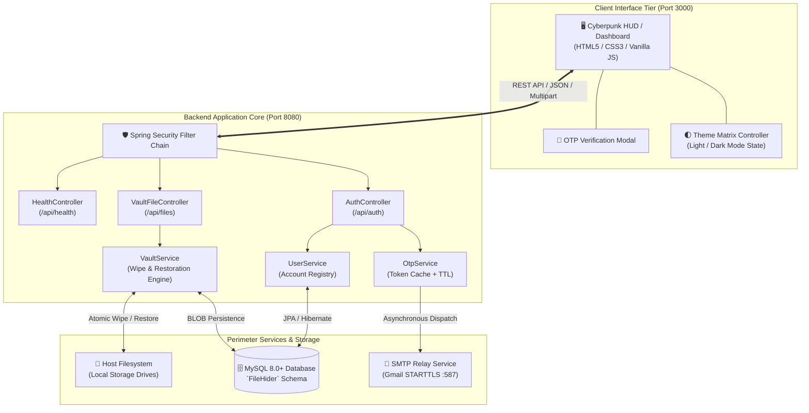
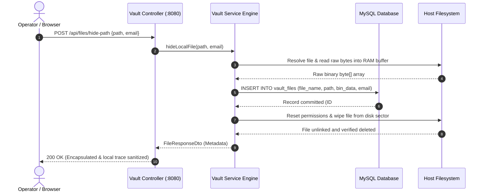

<div align="center">

# 🛡️ CYPHERVAULT
### *Military-Grade Zero-Knowledge File Matrix & Anti-Forensic Storage Engine*

[](https://spring.io/projects/spring-boot)
[](https://www.oracle.com/java/)
[](https://www.mysql.com/)
[](https://nodejs.org/)
[](#-theme-engine)
[](LICENSE)

<br/>

<p align="center">
  <b>CypherVault</b> is an enterprise-grade cryptographic file encapsulation and zero-trace security platform designed to isolate, protect, and anti-forensically sequester sensitive data. By converting target files into encapsulated relational binary payloads and cryptographically scrubbing disk sectors, CypherVault guarantees zero residual host footprint until OTP-authenticated restoration.
</p>

[Explore Features](#-core-capabilities) • [System Architecture](#-system-architecture) • [Getting Started](#-getting-started) • [REST API Reference](#-rest-api-specification) • [Security Model](#-threat-model--security-mechanisms)

---

</div>

## 📑 Table of Contents

- [🌟 Executive Summary](#-executive-summary)
- [✨ Core Capabilities](#-core-capabilities)
- [⚖️ Architecture Matrix (CypherVault vs. Traditional File Hiding)](#️-architecture-matrix)
- [🏗️ System Architecture](#️-system-architecture)
  - [High-Level Dataflow](#high-level-dataflow)
  - [Encapsulation & Disk Wipe Sequence](#encapsulation--disk-wipe-sequence)
- [🌓 Theme Engine (Light & Dark Matrix)](#-theme-engine)
- [💻 Technology Stack](#-technology-stack)
- [📁 Project Layout](#-project-layout)
- [🚀 Getting Started](#-getting-started)
  - [System Requirements](#system-requirements)
  - [1. Database Configuration](#1-database-configuration)
  - [2. Environment & Application Setup](#2-environment--application-setup)
  - [3. Starting the Backend Core](#3-starting-the-backend-core)
  - [4. Starting the Frontend HUD](#4-starting-the-frontend-hud)
- [🔌 REST API Specification](#-rest-api-specification)
  - [Authentication Service (`/api/auth`)](#1-authentication-service-apiauth)
  - [Vault File Service (`/api/files`)](#2-vault-file-service-apifiles)
  - [Core Health Monitor (`/api/health`)](#3-core-health-monitor-apihealth)
- [🔒 Threat Model & Security Mechanisms](#-threat-model--security-mechanisms)
- [⚙️ Configuration Parameters](#️-configuration-parameters)
- [🛠️ Troubleshooting & Diagnostics](#️-troubleshooting--diagnostics)
- [🗺️ Future Roadmap](#️-future-roadmap)
- [🤝 Contributing & Code of Conduct](#-contributing--code-of-conduct)
- [📄 License](#-license)

---

## 🌟 Executive Summary

Traditional operating system file hiding (e.g., hidden folder attributes or dotfiles) leaves metadata, filesystem entries, and unencrypted sectors intact on physical drives—rendering files vulnerable to standard forensic scrapers.

**CypherVault** solves this by establishing a zero-trace isolation lifecycle:
1. **Ingests** target local or uploaded payloads directly into memory buffers.
2. **Encapsulates** raw binary bytes into dedicated, access-controlled MySQL database stores (`LONGBLOB`).
3. **Forensically Scrubs** host drive sectors with atomic file wipes to prevent undelete recovery.
4. **Guards Retrieval** behind a time-bounded One-Time Password (OTP) verification perimeter dispatched asynchronously via secure SMTP channels.
5. **Reversibly Restores** binaries to their exact origin or downloads them securely upon verified request.

---

## ✨ Core Capabilities

- **🔐 Zero-Knowledge MFA OTP Authentication**
  - Instant dispatch of cryptographically random 6-digit verification codes.
  - Ephemeral in-memory OTP cache with strict 5-minute time-to-live (TTL) and auto-invalidation upon consumption.

- **🗂️ Dual Ingestion Pipelines**
  - **Direct Local Path Encapsulation**: Target absolute file paths (e.g., `C:\Sensitive\Financials.xlsx`); the engine serializes the binary and wipes the source file from disk immediately.
  - **Browser Drag & Drop / Staging Matrix**: Batch stage documents, binaries, and images through the client UI directly into secure database storage.

- **⚡ Bi-Directional Reversible Restoration**
  - Restore files seamlessly back to their exact original filesystem directory.
  - Export payloads on-demand via direct streaming download response pipelines.

- **🌓 Dual-Engine Visual Matrix (Light & Dark Themes)**
  - Seamless toggle between a crisp **White Theme** (Shadcn-inspired slate palette) and a stealth **Obsidian Dark Matrix** with luminous green HUD accents.
  - Automatic synchronization with operating system `prefers-color-scheme` and `localStorage` persistence.

- **📊 Real-Time Telemetry & Metric Matrix**
  - Live computation of total encapsulated assets, storage footprint reclaimed, and categorical distribution (Documents, Media, Code/Data, Archives).

- **🩺 Real-Time Engine Heartbeat**
  - Continuous non-blocking polling of backend health status (`/api/health`) with HUD pulse indicators.

---

## ⚖️ Architecture Matrix

| Metric / Dimension | Traditional OS File Hiding | Encryption Archives (Zip/RAR) | CypherVault Engine |
| :--- | :--- | :--- | :--- |
| **Filesystem Presence** | File & path visible to tools | File exists on disk as archive | **Zero host disk footprint** |
| **Forensic Traceability** | File table entry remains | Archive header remains | **Sanitized & unlinked** |
| **Access Verification** | None / OS login only | Static password only | **Dynamic Time-Bounded Email OTP** |
| **Restoration Capability** | Toggle attribute flag | Extract entire archive | **Precise atomic unhide to source path** |
| **Centralized Indexing** | Local filesystem search | None | **Relational index + Telemetry HUD** |
| **Platform Portability** | OS specific | Tool specific | **Full-stack cross-platform (Web + REST API)** |

---

## 🏗️ System Architecture

### High-Level Dataflow



---

### Encapsulation & Disk Wipe Sequence



---

## 🌓 Theme Engine

CypherVault features a built-in **Dual-Mode Matrix Theme Engine** tailored for both high-clarity daylight operations and low-light tactical environments:

<div align="center">

| Theme Mode | Design Philosophy | Primary Background | Card Surface | Accent Highlight |
| :--- | :--- | :--- | :--- | :--- |
| **Light Mode** | Clean modern Shadcn palette | `#f8fafc` (Slate 50) | `#ffffff` (Pure White) | `#16a34a` (Emerald 600) |
| **Dark Mode** | Obsidian Tactical HUD | `#090d16` (Pitch Obsidian) | `#0f172a` (Slate 900) | `#22c55e` (Cyber Green 500) |

</div>

- **Instant Switching**: Click the theme toggle button in the navigation header to flip between Light and Dark palettes.
- **Zero Flash of Unstyled Content (FOUC)**: Theme initialization runs synchronously on `DOMContentLoaded`.
- **System Preference Reactive**: Synchronizes with your device's native theme mode changes automatically.

---

## 💻 Technology Stack

### Backend Core
- **Framework**: [Spring Boot 3.3.0](https://spring.io/projects/spring-boot)
- **Language**: Java 21 LTS / 25
- **Security & Authorization**: Spring Security, BCrypt, Stateless Request Handling, CORS Filters
- **Persistence & ORM**: Spring Data JPA, Hibernate ORM, MySQL Connector/J
- **Email Infrastructure**: Spring Boot Starter Mail (`JavaMailSender` over SMTP STARTTLS)
- **Validation**: Jakarta Bean Validation (`spring-boot-starter-validation`)

### Frontend Architecture
- **Structure**: Semantic HTML5 with accessibility ARIA tokens
- **Styling**: Vanilla CSS3 Custom Property Token System (No external bulky runtime libraries)
- **Typography**: Google Fonts (*Outfit*, *JetBrains Mono*, *Space Grotesk*)
- **Logic**: Vanilla ES6+ Asynchronous JavaScript
- **Static Server**: Embedded Node.js HTTP Server (`server.js`)

---

## 📁 Project Layout

```
FileHiderApp/
├── backend/                                   # Spring Boot Core Application
│   ├── src/
│   │   ├── main/
│   │   │   ├── java/com/filehider/
│   │   │   │   ├── FileHiderApplication.java  # Spring Boot Microservice Entrypoint
│   │   │   │   ├── config/
│   │   │   │   │   └── SecurityConfig.java    # Security chains, CORS & CSRF policies
│   │   │   │   ├── controller/
│   │   │   │   │   ├── AuthController.java    # Email OTP generation, signup & login
│   │   │   │   │   ├── HealthController.java  # Core uptime & database heartbeat API
│   │   │   │   │   └── VaultFileController.java# Hide, unhide, list, stream & delete APIs
│   │   │   │   ├── dto/                       # Data Transfer Objects (Payload contracts)
│   │   │   │   │   ├── ApiResponse.java       # Standardized unified API response wrapper
│   │   │   │   │   ├── AuthRequest.java       # Login/registration authentication request
│   │   │   │   │   ├── FileResponseDto.java   # File descriptor & metadata contract
│   │   │   │   │   ├── HidePathRequest.java   # Local absolute file path encapsulation model
│   │   │   │   │   ├── SendOtpRequest.java    # OTP dispatch request payload
│   │   │   │   │   └── UnhideRequest.java     # File restoration request payload
│   │   │   │   ├── entity/
│   │   │   │   │   ├── User.java              # User credential entity (JPA mapped)
│   │   │   │   │   └── VaultFile.java         # Encapsulated file record & BLOB storage
│   │   │   │   ├── repository/
│   │   │   │   │   ├── UserRepository.java    # Spring Data repository for users
│   │   │   │   │   └── VaultFileRepository.java# Spring Data repository for vault records
│   │   │   │   └── service/
│   │   │   │       ├── OtpService.java        # In-memory OTP cache, generation & SMTP relay
│   │   │   │       ├── UserService.java       # Account registration and resolution
│   │   │   │       └── VaultService.java      # Byte serializer, sector wiper & restorer
│   │   │   └── resources/
│   │   │       └── application.properties     # Core properties, DB URL, SMTP credentials
│   ├── pom.xml                                # Maven build & dependency matrix
│   ├── start-backend.bat                      # Windows one-click batch launcher
│   └── start-backend.ps1                      # PowerShell automated compiler & runner
├── frontend/                                  # Web Client Tier
│   ├── index.html                             # Cyberpunk HUD Web Application
│   ├── style.css                              # Dual Theme (Light/Dark) design system
│   ├── app.js                                 # Client state manager & REST API controller
│   └── server.js                              # Lightweight Node.js static server (:3000)
└── README.md                                  # Comprehensive System Documentation
```

---

## 🚀 Getting Started

### System Requirements

| Tool | Minimum Version | Verified Version | Purpose |
| :--- | :--- | :--- | :--- |
| **Java JDK** | 21.0.0+ | Java 21 / 25 | Backend Core Execution & Compilation |
| **MySQL Server** | 8.0.0+ | MySQL 8.0 / 8.4 | Relational Data & Encapsulated Binary Storage |
| **Node.js** | 18.0.0+ | Node.js 20.x / 22.x | Frontend Static Server Host |
| **Maven** | 3.8.0+ | Maven 3.9+ | Dependency Build & Packaging *(Optional)* |

---

### 1. Database Configuration

Initialize the MySQL database instance:

```sql
CREATE DATABASE IF NOT EXISTS FileHider
  CHARACTER SET utf8mb4
  COLLATE utf8mb4_unicode_ci;
```

---

### 2. Environment & Application Setup

Open [`backend/src/main/resources/application.properties`](file:///c:/Users/SATWIK/OneDrive/Desktop/FileHiderApp/backend/src/main/resources/application.properties) and update the configuration variables:

```properties
# Server Listening Port
server.port=8080

# Database DataSource
spring.datasource.url=jdbc:mysql://localhost:3306/FileHider?createDatabaseIfNotExist=true&useSSL=false&allowPublicKeyRetrieval=true&serverTimezone=UTC
spring.datasource.username=root
spring.datasource.password=YOUR_SECURE_MYSQL_PASSWORD

# JPA / Hibernate Auto Schema Generation
spring.jpa.hibernate.ddl-auto=update
spring.jpa.properties.hibernate.dialect=org.hibernate.dialect.MySQLDialect

# Gmail SMTP Relay (For OTP Dispatch)
spring.mail.host=smtp.gmail.com
spring.mail.port=587
spring.mail.username=your-email@gmail.com
spring.mail.password=your-16-character-app-password
spring.mail.properties.mail.smtp.auth=true
spring.mail.properties.mail.smtp.starttls.enable=true

# Upload Payload Limits
spring.servlet.multipart.max-file-size=100MB
spring.servlet.multipart.max-request-size=100MB
```

> [!TIP]
> **Gmail App Password**: If using Gmail for OTP delivery, enable 2-Step Verification in your Google Account and generate an **App Password** from *Security > 2-Step Verification > App passwords*.

---

### 3. Starting the Backend Core

Select your preferred startup method:

#### Option A: Automated PowerShell Launcher (Recommended on Windows)
```powershell
cd backend
.\start-backend.ps1
```
*The script automatically frees port 8080 if occupied, gathers dependencies from your local `.m2` repository, compiles changed classes, and launches the server.*

#### Option B: Standard Maven Build & Run
```bash
cd backend
mvn clean spring-boot:run
```

The backend server is live at: **`http://localhost:8080`**

---

### 4. Starting the Frontend HUD

1. Open a new terminal session, navigate to the `frontend` directory, and run:

```bash
cd frontend
node server.js
```

2. Open your browser and navigate to:
👉 **`http://localhost:3000`**

---

## 🔌 REST API Specification

All API endpoints return standard unified response payloads following the format:

```json
{
  "success": true,
  "message": "Operation completed successfully",
  "data": { ... }
}
```

---

### 1. Authentication Service (`/api/auth`)

#### `POST /api/auth/send-otp`
Dispatches a 6-digit OTP verification code to the specified email address.

- **Request Body:**
  ```json
  {
    "email": "agent@cyphervault.sec",
    "mode": "login"
  }
  ```
  *(Mode can be `"login"` or `"signup"`)*

- **Response (200 OK):**
  ```json
  {
    "success": true,
    "message": "OTP dispatched successfully to your email: agent@cyphervault.sec",
    "data": {
      "email": "agent@cyphervault.sec"
    }
  }
  ```

---

#### `POST /api/auth/login`
Validates the submitted OTP and authenticates the user session.

- **Request Body:**
  ```json
  {
    "email": "agent@cyphervault.sec",
    "otp": "481920"
  }
  ```

- **Response (200 OK):**
  ```json
  {
    "success": true,
    "message": "Authentication successful",
    "data": {
      "email": "agent@cyphervault.sec",
      "name": "Special Agent"
    }
  }
  ```

---

#### `POST /api/auth/signup`
Registers a new user profile upon successful OTP validation.

- **Request Body:**
  ```json
  {
    "name": "Alex Mercer",
    "email": "alex@cyphervault.sec",
    "otp": "481920"
  }
  ```

---

### 2. Vault File Service (`/api/files`)

#### `GET /api/files?email={email}`
Retrieves metadata of all files sequestered by the specified user account.

- **Response (200 OK):**
  ```json
  {
    "files": [
      {
        "id": 101,
        "fileName": "Project_Chimera_Specs.pdf",
        "path": "C:\\Vault\\Classified\\Project_Chimera_Specs.pdf",
        "email": "alex@cyphervault.sec",
        "fileSize": 2458920
      }
    ]
  }
  ```

---

#### `POST /api/files/hide`
Uploads a multipart file payload, persists it into the database, and wipes any matching local path if located.

- **Request Type:** `multipart/form-data`
- **Parameters:**
  - `file`: *Binary file stream*
  - `email`: `alex@cyphervault.sec`
  - `path`: *(Optional original path string)*

---

#### `POST /api/files/hide-path`
Encapsulates a file directly from an absolute path on the host filesystem and securely wipes the source file.

- **Request Body:**
  ```json
  {
    "path": "C:\\Users\\User\\Documents\\Financials.xlsx",
    "email": "alex@cyphervault.sec"
  }
  ```

- **Response (200 OK):**
  ```json
  {
    "success": true,
    "message": "File hidden and wiped from local path",
    "data": {
      "id": 102,
      "fileName": "Financials.xlsx",
      "path": "C:\\Users\\User\\Documents\\Financials.xlsx",
      "email": "alex@cyphervault.sec",
      "fileSize": 142051
    }
  }
  ```

---

#### `POST /api/files/unhide`
Extracts the encapsulated binary from the database, writes it back to its original filesystem path, and removes the vault entry.

- **Request Body:**
  ```json
  {
    "id": 102
  }
  ```

---

#### `GET /api/files/download?id={id}`
Streams the decrypted binary file payload directly to the client browser as an octet-stream attachment.

---

### 3. Core Health Monitor (`/api/health`)

#### `GET /api/health`
Heartbeat monitor for connection telemetry and load balancers.

- **Response (200 OK):**
  ```json
  {
    "status": "UP",
    "framework": "Spring Boot 3.3.0",
    "service": "CypherVault Spring Boot Backend",
    "timestamp": 1772473500000
  }
  ```

---

## 🔒 Threat Model & Security Mechanisms

```
+-------------------------------------------------------------------------+
|                       CYPHERVAULT SECURITY MODEL                        |
+-------------------------------------------------------------------------+
|                                                                         |
|  [1. INGESTION]       Read target file into isolated heap buffer        |
|                                                                         |
|  [2. BLOB STORE]      Persist binary payload into MySQL LONGBLOB        |
|                                                                         |
|  [3. SANITIZE DISK]   Atomic wipe: Reset permissions & delete sector    |
|                                                                         |
|  [4. AUTH BARRIER]    Time-bounded ephemeral OTP with 5-min TTL         |
|                                                                         |
|  [5. RESTORATION]     Reversible write-back to verified target path     |
|                                                                         |
+-------------------------------------------------------------------------+
```

1. **Anti-Forensic Sector Scrubber (`wipeFileFromDisk`)**:
   - Resets read/write/execute access attributes to prevent operating system lockups.
   - Utilizes low-level Java NIO `Files.deleteIfExists()` and atomic file handles to unlink the disk file immediately after confirmation of the database transaction commit.

2. **In-Memory Nonce & OTP Vault**:
   - Verification tokens are generated using a cryptographically secure pseudo-random number generator (`SecureRandom`).
   - Tokens are decoupled from database persistence to minimize token exposure risks and expire strictly within 300 seconds.

3. **Stateless Rest API Isolation**:
   - The Spring Security configuration enforces explicit CORS origins, disallows unauthorized framing (`X-Frame-Options: SAMEORIGIN`), and ensures protected API isolation.

---

## ⚙️ Configuration Parameters

| Environment Key / Property | Default | Description | Impact |
| :--- | :--- | :--- | :--- |
| `server.port` | `8080` | Spring Boot TCP listening port | Network listener |
| `spring.datasource.url` | `jdbc:mysql://.../FileHider` | MySQL JDBC connection URI | Storage persistence |
| `spring.servlet.multipart.max-file-size` | `100MB` | Maximum single file upload limit | Memory & upload buffer |
| `spring.servlet.multipart.max-request-size`| `100MB` | Maximum multipart request payload limit | Request filtering |
| `spring.mail.host` | `smtp.gmail.com` | SMTP gateway provider host | OTP delivery channel |
| `spring.mail.port` | `587` | SMTP gateway port (STARTTLS) | Encrypted transport |
| `logging.level.com.filehider` | `INFO` | Internal logging verbosity | Diagnostic monitoring |

---

## 🛠️ Troubleshooting & Diagnostics

<details>
<summary><b>1. Port 8080 or Port 3000 is already in use</b></summary>

- **Backend (Port 8080)**: Running `start-backend.ps1` or `start-backend.bat` automatically identifies and terminates rogue processes binding port 8080.
  - Manual kill command (PowerShell):
    ```powershell
    Get-NetTCPConnection -LocalPort 8080 | ForEach-Object { Stop-Process -Id $_.OwningProcess -Force }
    ```
- **Frontend (Port 3000)**: Terminate node instances or change `PORT` in [`frontend/server.js`](file:///c:/Users/SATWIK/OneDrive/Desktop/FileHiderApp/frontend/server.js).
</details>

<details>
<summary><b>2. MySQL Access Denied / Connection Refused</b></summary>

- Verify MySQL is running on port 3306:
  ```powershell
  Get-Service -Name MySQL*
  ```
- Ensure the username and password in [`backend/src/main/resources/application.properties`](file:///c:/Users/SATWIK/OneDrive/Desktop/FileHiderApp/backend/src/main/resources/application.properties) match your MySQL root or dedicated user credentials.
</details>

<details>
<summary><b>3. Email OTP Not Received</b></summary>

- Verify your Gmail App Password is configured without spaces in `application.properties`.
- Check backend console logs: In development mode, the OTP is also printed directly to the terminal stdout for emergency debug recovery.
</details>

---

## 🗺️ Future Roadmap

- [ ] **Client-Side AES-256-GCM Pre-Encryption**: WebCrypto zero-knowledge encryption before packets leave the browser.
- [ ] **Hardware Security Key / WebAuthn**: FIDO2 YubiKey biometric integration for passwordless authentication.
- [ ] **S3 / Cloudflare R2 Stealth Vault Driver**: Secondary off-site encrypted cold storage driver.
- [ ] **DOD 5220.22-M Multi-Pass Shredding**: Multi-pass pseudorandom disk overwriting before deletion.

---

## 🤝 Contributing & Code of Conduct

We welcome security audits, optimizations, and feature PRs.

1. **Fork** the Repository.
2. **Create a Feature Branch**: `git checkout -b feature/AdvancedEncryption`
3. **Commit Changes**: `git commit -m 'feat: Add multi-pass sector shredding'`
4. **Push to Branch**: `git push origin feature/AdvancedEncryption`
5. **Open a Pull Request** with architectural breakdown and test logs.

---

## 📄 License

This software is distributed under the terms of the **[MIT License](LICENSE)**.

<div align="center">
  <sub>Engineered with precision by the <b>CypherVault Security Team</b> • 2026</sub>
</div>
